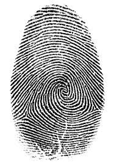
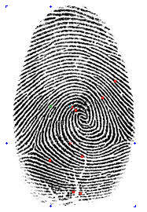
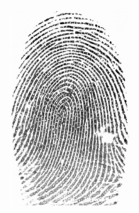
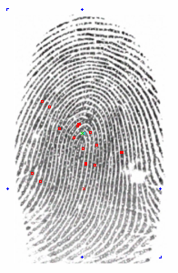

# Fingerprints

Fingerprint image analysis in Go. Identify, compare and match biometric
fingerprint images.

# Running the library

This is a good summary of what happens when you run this software
on a fingerprint image. On the right is the input image, on the left
is a debug output image.

The library detects features of the fingerprint (bifurcations, terminations ...)
which represent the "identity" of the fingerprint. It provides matching functions
to assert whether two fingerprint images are from the same person, or not.
